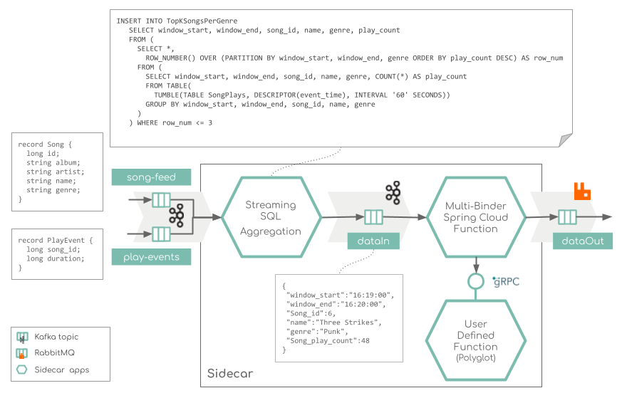

# Overview

Mock music ranking application to showcase real-time streaming with (embedded) Apache Flink Streaming SQL and Spring Cloud Functions.
It demos how to integrate complex SQL streaming aggregating ([Apache Flink](https://nightlies.apache.org/flink/flink-docs-master/docs/dev/table/sql/queries/overview/)) 
and [Spring Cloud Function](https://spring.io/projects/spring-cloud-function), using multiple binders (Kafka & Rabbit) and polyglot User Defined Functions over [gRPC SCF Adepter](https://github.com/spring-cloud/spring-cloud-function/tree/main/spring-cloud-function-adapters/spring-cloud-function-grpc#two-operation-modes-clientserver).   



The streaming Music application demonstrates how to build of a simple music charts application that continuously computes, 
in real-time, the latest charts such as latest Top 3 songs per music genre. 
The application's input data is in [Avro format](./play-songs-generator/src/main/resources/avro), hence the use of Confluent Schema Registry, and comes from two Kafka sources (e.g. topics): 
a stream of play events (think: "song X was played") and a stream of song metadata ("song X was written by artist Y").

* The `Streaming SQL Aggregation` app leverages Apache Flink to compute the top 3 songs per genre every 1 min. 
It uses the Flink SQL streaming API as explained here: [sql-aggregator](./sql-aggregator). 
The computed aggregate (in JSON format) is streamed to another Kafka topic: `dataIn`.
* The `Multi-Binder Spring Cloud Function` app receives its input from the `dataIn` Kafka topics and emits its result to a `dataOut` RabbitMQ channel.
The multibinder send the received `dataIn` messages to User Defined Function over gRPC. the response form teh UDF is then send to the `dataOut` RabbitMQ channel.  

(The use case is inspired by the https://github.com/confluentinc/examples/tree/6.0.4-post/music)

# Quick start

### Kubernetes (MiniKube) Deployment

##### 1. Start a Minikube cluster

```
minikube start --memory 8192
```

#### 2. Deploy Kafka, Schema Registry and RabbitMQ

From within the root folder run:
```
kubectl apply -f ./k8s-templates/kafka
kubectl apply -f ./k8s-templates/rabbitmq
```

#### 3. Start play songs data generator

From within the root folder run:
```
kubectl apply -f ./k8s-templates/generator
```
The generator streams (once) 12 songs to the `songs-feed` topic (using the Song avro schema) and 
then will continuously stream play events to the `play-events` topic. 
You can configure the topic names and the streaming rate.

#### 4. Deploy the Music stream processing app

```
kubectl apply -f ./k8s-templates/app
```

#### 5. Check the topics

Use the `kubectl get all` to find the Kafka broker pod name and then 
`kubectl exec -it pod/<your-kafka-pod> -- /bin/bash` to SSH to kafka broker container.

From within the kafka-broker container use the bin utils to list the topics or check their content: 
```
/opt/kafka/bin/kafka-topics.sh --list --bootstrap-server localhost:9092
/opt/kafka/bin/kafka-console-consumer.sh --topic daataIn --from-beginning --bootstrap-server localhost:9092
```

#### 6. Delete cluster 

```
kubectl delete cm,pod,deployment,rc,service -l type="streaming-spike"
```

#### Optional Port Forwarding for local host access

```
kubectl port-forward svc/s-registry 8081:8081
kubectl port-forward svc/kafka 9094:9094
kubectl port-forward svc/rabbitmq 5672:5672
kubectl port-forward svc/multibinder-grpc 8089:8089
```