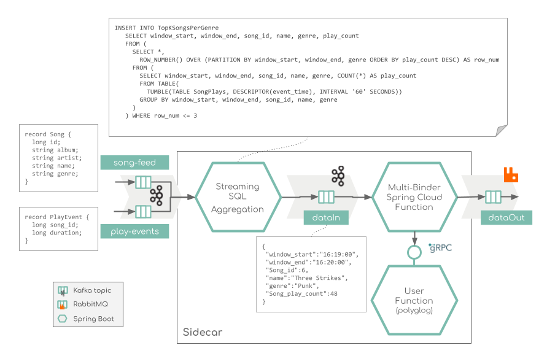

# Overview

Mock music ranking application to showcase real-time streaming with Apache Flink Streaming SQL and Spring Cloud Function.



The streaming Music application demonstrates how to build of a simple music charts application that continuously computes, 
in real-time, the latest charts such as latest Top 3 songs per music genre. 
The application's input data is in 
Avro format, hence the use of Confluent Schema Registry, and comes from two sources: a stream of play events 
(think: "song X was played") and a stream of song metadata ("song X was written by artist Y").

(The use case is inspired by the https://github.com/confluentinc/examples/tree/6.0.4-post/music)

# Quick start

### Kubernetes (MiniKube) Deployment

##### 1. Start a Minikube cluster

```
minikube start --memory 8192
```

#### 2. Deploy Kafka, Schema Registry and RabbitMQ

From within the root folder run:
```
kubectl apply -f ./k8s-templates/kafka
kubectl apply -f ./k8s-templates/rabbitmq
```

#### 3. Start play songs data generator

From within the root folder run:
```
kubectl apply -f ./k8s-templates/generator
```

#### 4. Deploy the Music stream processing app

```
kubectl apply -f ./k8s-templates/app
```


#### 5. Check the topics

```
/opt/kafka/bin/kafka-topics.sh --list --bootstrap-server localhost:9092
/opt/kafka/bin/kafka-console-consumer.sh --topic song-feed --from-beginning --bootstrap-server localhost:9092
```


#### 6. Delete cluster 

```
kubectl delete cm,pod,deployment,rc,service -l type="streaming-spike"
```

#### Optional Port Forwarding for local host access

```
kubectl port-forward svc/s-registry 8081:8081
kubectl port-forward svc/kafka 9094:9094
kubectl port-forward svc/rabbitmq 5672:5672
kubectl port-forward svc/multibinder-grpc 8089:8089
```