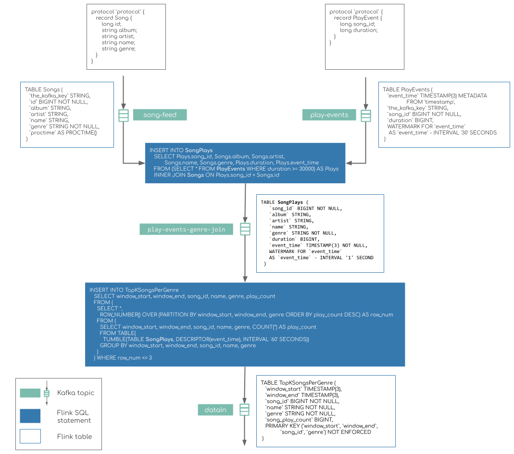

# SQL Streaming Aggregator

## Overview
Spring Boot app that embeds a Apache Flink cluster (e.g. Flink local environment execution).

The `SqlAggregatorApplicationProperties#executeSql` property defines the list of SQL statements to be executed.
The SQL statements are executed in the order of their definition!

If the `SqlAggregatorApplicationProperties#continuousQuery` property is set the corresponding  
SQL statement is executed as a last statement and the query result is printed on the standard output.
This is useful to run continuous SQL query.


## Music Charts Demo
The Music charts application demo defines these SQL statements: [application.properties](./src/main/resources/application.properties).
(For Kubernetes the `ConfigMaps` is used instead: [multibinder-grpc-config.yaml](../k8s-templates/app/multibinder-grpc-config.yaml))

Following diagram shows the Music Charts aggregation pipeline:



## Build/push docker image
```
./mvnw clean install
 docker build -t tzolov/poc-sql-aggregator:latest .
 docker push tzolov/poc-sql-aggregator:latest
```